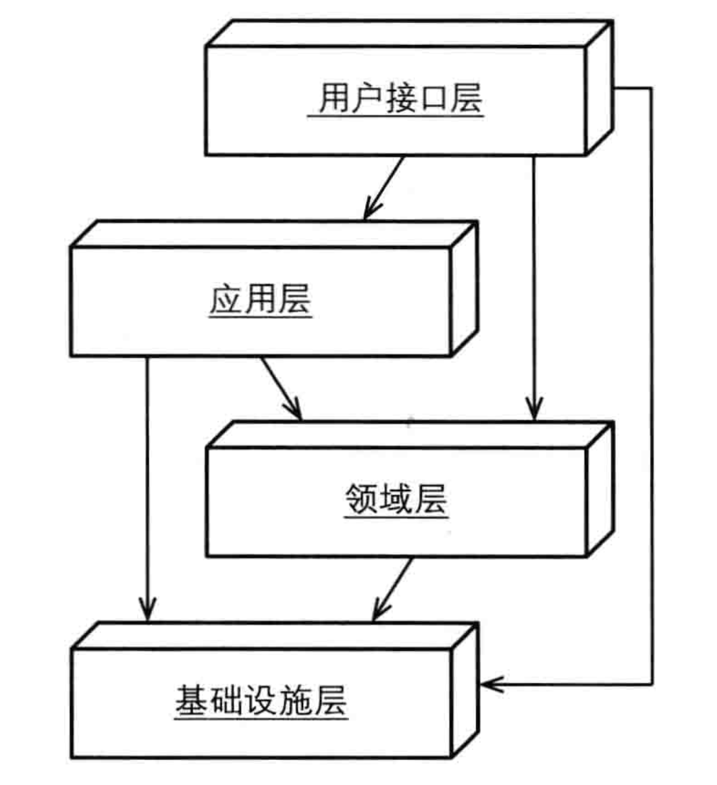

# 第四章、架构

## 一、架构演进

1. 分层
2. ＤＩＰ依赖倒置
3. 六边形
4. ＣＱＲＳ

## 二、分层架构

1. 用户接口层：可以看作为是api层，比如grpc / rest api / openapi等等。它包括对请求数据的校验。它和应用层是一对一的关系，也就是一个endpoint对应于应用层的一个方法。它校验请求数据之后，调用应用层接口处理请求。

2. 应用层：可以用于控制持久化事务和安全认证

   * 它聚合领域层操作，决定这些聚合的操作要么全部成功，要么全部失败
   * 它检查访问权限，决定请求是否可以访问相关的功能。
   * 可以简单认为他是外部对本领域操作的实现，无论采用的是什么格式（REST API / GRPC.....）

   应用层很薄，也应该设计得很薄。

3. 领域层，抽象的业务逻辑层。为什么是抽象呢？因为他不需要知道具体是怎么存储数据或者具体是怎么发送消息的。这一层所有的调用都是面向接口的调用，而具体的实现，则是由基础设施层去实现。

   举个例子：领域层有一个创建订单的业务方法，它调用OrderRepository这个interface的save方法去持久化订单，至于这个持久化是存入数据库呢还是调用什么别的存储，它是不用理会的，而理会的是基础设施层自己的实现。基础设施层的实现可以选择保存在数据库里，也可以选择调用别的外部服务去存储。

   在这一层中存在着这样大量的定义接口，例如：MessageAdaptor / NotificationAdaptor之类的，领域层只是负责处理业务逻辑，调用接口完成业务逻辑的需求，而接口的实现则是由基础设施层去做。

4. 基础设施层，可以理解为对领域层定义的能力的实现。

> 这是我在学习面向接口编程的时候就想到的方法，大概在Evans的书出来第一版的时候。但是那时这本书真没办法实施落实，所以也就没有往这个方向去看。

分层架构的一个重要的原则：每层只能与位于其下方的层发生的耦合。也就是说，不能跨层访问，也不能反方向访问，即底层访问上层。

不过也有方式可以让底层访问上层，仅只有一种方式：回调。上层实现底层定义的回调接口，然后将这个实现当成参数传入到底层方法中，当底层方法处理完后，通过调用实现回调上层。

## 三、依赖倒置原则

其实就是分层架构。不过定义了更为合理实现原则。

1. 由上层定义下层应实现的能力
2. 由下层去实现上层定义的能力
3. 上层通过框架的依赖注入功能，将下层的实现注入到本层中，其实就是本文之前对分层架构的讲述一样。

> 书中所说的反向依赖其实是下层对上层定义的接口的依赖。

### 一些想法

以前都是站在供应商的方式去思考着的，将下层看成是供应商，供应商定义自己能够实现的能力，让上层去挑选使用，往往这样需要定义大量的接口方法，而不论这里接口方法是否真的会被使用到。而上层则是要聚合大量方法才能实现一个功能，哪怕这些功能很多地方并不是本层所需要的（你提供了一水桶的水，而我只要一勺）。

而DDD的思想则是相反，它只定义上层对下层的需求，将其定义为接口，而下层则需要按上层的要求去实现。这样的方式减少了大量的浪费，而且目的非常明确，直击需求。

后面的开发会按照这样的模式去安排，觉得颇为有效。

## 四、六边形架构

1. 在六边形架构中，不同的客户通过“平等”的方式与系统交互。
2. 来个新的客户，只需要添加一个新的适配器将客户输入转化成能被系统ＡＰＩ所理解的参数就可以了。
3. 系统的输出，诸如图形界面、消息、接口等都可以通过不同的方式实现。
4. 很多分层架构其实实际上使用的是六边形架构。

六边形架构分为两个区域：

1. 外部区域：接收不同客户提交的输入，将输入转化成内部区域的输入。
2. 内部区域：获取持久化数据，并对程序输出进行存储，或者转发数据。

每种类型的客户都有它自己的适配器，该适配器用于将客户输入转化为程序内部API所能理解的输入。

六边形每条不同的边代表不同种类型的端口，端口要么处理输入，要么处理输出。可以这么理解，每一边代表一种通信协议，如ＨＴＴＰ，ＴＣＰ等，一边可以有多个适配器，每一个适配器代表一种数据协议：gRPC / Rest API / SOAP 等。当客户请求到达时，都应该有相应的适配器对输入进行转化，然后端口将调用应用程序的某个操作或者向应用程序发送一个事件，控制权由此交给内部区域。

> **一些理解**
>
> 这里六边形架构中，外部区域并不是分层架构中的用户接口层，而是用户接口层之外的一层。
>
> 用户接口层等分层都属于内部区域，用户接口层则是提供通用的ＡＰＩ接口，比方说RestAPI，如果你有XML的输入，用户接口层并不再提供相应的输入点，而是在用户接口层外，也就是外部区域创建相应的适配器将ＸＭＬ转化成通用ＡＰＩ接口所能读取的数据。
>
> 外部访问本领域的ＡＰＩ时，也是通过相应的端口访问，而不能直接访问ＡＰＩ。访问分为两种：
>
> 1. 外部客户访问，往往这种访问附带用户信息，比如jwt token之类的，而往往本域有些请求需要访问别的支撑域或者通用子域的ＡＰＩ才能完成用户的请求。这时就需要在外部区域增加输出适配器（往往内置或者更为轻量的微服务）组装请求（比如拼凑ＨＥＡＤＥＲ之类的）以访问支撑域或者通用子域的外部区域端口。
> 2. 内部e2e访问，这类访问不是由用户发起，而是由服务内部发起，比如定时任务、流程引擎等，这类请求也是需要访问外部区域的端口，验证输入的e2e token，而访问支撑域或者通用子域ＡＰＩ时，也是要生成相应的e2e token，访问相应的端口。
>
> 从上面的讨论，内部区域的用户接口层的接口定义应该与具体输入端口无关，它就是一种service api，也就是工具型ＡＰＩ。
>
> 由此，六边形架构是对原分层架构的扩展。六边形架构建立的意义在于清楚地描述输入渠道，表明进入分层架构之前的外部情况。
>
> 所以在开发时，应针对用户故事来开发用户接口层，而不是针对外部区域的适配置来开发。也就是，先开发用户接口层，然后再开发相应的适配器。

> **关于e2e调用的理解**
>
> 前面讲了外部客户访问这一块，其实有一个很明显的逻辑冲突：当内部区域已经无区别各种适配输入，那么也就是说它也就不持有外部客户相关认证信息，比如说jwt token之类的，当它要调用支撑域以完成请求时，因没有这些认证信息，所以他是无法完成像外部区域一样访问支撑域的，而只能动用内部的e2e访问。
>
> 所以可以总结出一个架构规则：
>
> 1. 内部各子域间的访问只能通过e2e访问，而无法做到附带认证信息的访问
> 2. bff api是一个例外，它聚合所有的子域的ＡＰＩ，因为是聚合，所以它是可以不遵循分层架构的。
>
> 当然，如果将外部区域和内部区域都集成在一个工程内部的话，当然可以实现带认证信息的ＡＰＩ访问。
>
> 从书中后续的讲述来看，它的确是认为将外部区域和内部区域都集成在一个工程内部的。

> **关于存储层的思考**
>
> 在上一家公司（做银行业务的），它采用的微服务架构，将微服务分为eapi / papi / sapi，其中sapi负责存储，papi负责业务逻辑，eapi负责处理输入。
>
> 我现在明白他的意思了，其实它采用的就是六边形架构，印度三哥果然牛逼。
>
> 一开始我并不理解sapi的用途，一直以为sapi就是service api，用于处理业务逻辑的，而papi是portal api，处理用户输入的，而eapi则是一种为了达到安全要求而设立的一种适配层。在项目进行过程中，我们一直按这个思路去做，直到和一些老程序员一起code reivew的时候，明显思路对不上，我们迷惑，他们也没办法说清楚。明显，我们违反了架构设计的原则，而他们则没有理解这个架构原则。
>
> 所以，
>
> 对于内部区域来说，它关注的是业务逻辑，而并不关注如何存储，如何应答请求，所以也就会存在输入适配器和输出适配器这样的东西了。
>
> 但是像上面说的那个用一个sapi专门来处理存储也不合理，对于处理事务来说，一次对处请求属于一次事务，而在应用层聚合的领域层会导致多次存存储请求，从而导致本应一次事务处理的请求到了存储成变成了多次事务，从而达不到事务的原子性。所以一般来说，数据库存储应内置在内部区域。而非数据库事务存储则可以置于外部区域，比如文件、对象存储等。

> **六边形架构与分层架构的思考**
>
> 在我看来这两货就是一个货。
>
> 只是分层架构的`基础设施层`变成了外部区域的输出适配器而已。
>
> 所以，六边形架构就是一个把`基础设施层`改成外部区域的输出适配器而已。

## 五、面向服务的架构

书中写的其实就是六边形架构的一个应用实例，可以理解为，为六边形架构添加SOA适配器。

## 六、REST

书中写的其实就是六边形架构的一个应用实例，可以理解为，为六边形架构添加REST适配器。

## 七、CQRS

书本里关于CQRS这部分写得并不好。即没有说明ＣＱＲＳ应该在哪一层，也没有具体的例子，几段代码也还是领域层的代码，想象空间过大，所以没有定论。

不过也可以从书本上下文中知晓一二。

1. ＣＱＲＳ将操作和查询分离
   * 查询称为查询处理器，处理复杂的查询，可以通过下面的方式处理：
     * 创建数据库视图，将多表数据组合
     * 通过多次多表查询数据，最终组合
   * 操作称之为命令处理器，处理更新、新建、删除等操作
     * 命令处理器不允许有除fromId之外的查询方法
     * 仅只有一个查询方法就是fromId
     * 命令处理器操作执行完成后，将发布领域事件
     * 通过事件订阅机制，更新查询处理器查询模型
       * 如果查询和命令处理器使用同一个数据库，则在同一事务中更新了查询模型，所以也就没有必要订阅领域事件了。
       * 如果查询和命令处理器操作的不是同一个数据源，比如说查询是先优先查缓存再查数据库，那么这时订阅领域事件则相当有用，当领域事件到达时，清空缓存，重新载入数据，可达到数据一致性。
2. CQRS最终一致性
   * 如果查询和命令处理器操作的不是同一个数据源，那么在领域事件到达之前有一段时间用户显示的数据仍时未更新前的数据。这时处理方式有两种：
     * 显示用户提交的数据，而不是从服务端获取的数据。举个例子，用户通过form提交数据到服务端，为了更快显示最新的数据，直接将提交的数据用于显示，而不是再从服务端获取最新的数据（这个时候数据还没有更新）
     * 显示当前数据的最后修改时间，即暗示用户该数据是过去的数据，最新的数据仍未生效。

ＣＱＲＳ是我在之前的一个项目中遇到过，当时北京的架构师初始化了这么个技术架构。当时知识不够，不能理解其中微妙，现在想起来真是遗撼。

虽然书中没有详细讲解在实操中怎么去做，不过其它书里有提到，可以从别的地方去了解它。

不过ＣＱＲＳ我觉得并不是必须的架构。对于一般的业务型应用访问量不大，完全可以将查询和操作放在一起。对于访问量大的才会有这样的需求，特别是查询缓存的应用。

## 八、事件驱动架构

事件大致上可以分为两种：

1. 领域事件，我们主要关注这种事件
2. 系统事件

领域事件通过消息队列中间件作为介质进行传播，领域事件从一个限界上下文输入端口传入到另一个限界上下文的输入端口，由事件订阅方对事件进行处理。

领域事件也可以给本限界上下文的组件订阅，比方之前说的命令处理器执行完操作后发布领域事件则可由查询处理器订阅，查询处理器接收到相关的领域事件后进行相应的更新。

### 1. Saga

Saga模式，又称为长时处理过程。

当一个领域事件发生触发多个限界上下文的共同处理，只有这些限界上下文的处理都成功处理了才算是一次领域事件的处理，Saga模式就是处理这种情形的。

Saga会设立一个协调者，该协调者会发出领域事件，而领域事件的订阅者处理完后再发送一个处理结果事件，协调者收到结果事件后，再发送下一步的领域事件，如此反复，直到完成为止。如果中途有些事情处理产生异常，则协调者发布回滚领域事件，之前处理的订阅者都会执行相关的回滚操作（事后补偿）

Saga是最终一致性的代表，它牺牲了强一致性，不适合像银行转帐这样的应用场景，但却非常适合一些对实时生要求并不是很强的应用场景，比如说下单，当客户下完单后并不要求立即向物流发送一个托运请求，这个就可以用Saga来做。

而Saga一般会用流程引擎来实现。

### 2. 事件源

这个对我来说算是一个新东西。

这个东西就是记录初始领域事件，通过一个专门的领域事件微服务记录。

初始事件记录，其中过程中仍会触发别的事件，则这些都是次级事件，并记录上级事件和根事件。在分布式业务系统中，这个相当有用。

另，在我上家公司也有相关的机制，不过并不是使用集中的微服务处理，而是各个限界上下文自行记录请求者的事件（仅仅只是记录是由哪个子系统来的，reference id是什么）

## 九、数据网络和基于网格的分布式计算

这里就不看了，在不了解大量的基础知识的情况下强行看这些资料，带来就是厌误，影响学习的动力。

先看后面战术建模，最后再回来重新看这一章的东西，或许又是另一番天地。

